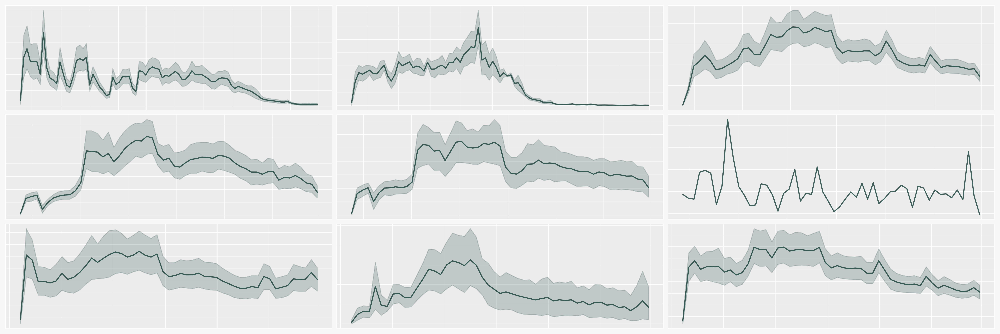

  <h1>Demand Forecasting</h1>
  
  

    Hierarchical demand forecasting with LightGBM
  

  
  [View the code](Forecasting.ipynb)
  
  

# Table of Contents

- [About the project](#s1)
  * [1. Goal](#s1.1)
  * [2. Data description](#s1.2)
- [Key features](#s2)
  * [1. Time-series clustering](#s2.1)
  * [2. Hyperparameter tuning with Optuna](#s2.2)
  * [3. SHAP values](#s2.3)

# <a name="s1"/> About the project

## <a name="s1.1"/> 1. Goal

Tackle the problem of hierarchical time-series forecasting using gradient boosting.

## <a name="s1.2"/> 2. Data description

For this project, real-world data of beer consumption in Russia were used. All data were anonimised and modified. The dataset consists of more than 1400 weekly time series and has over 130000 observations.

# <a name="s2"/> Key features

## <a name="s2.1"/> 1. Time-series clustering

Dynamic time warping (DTW) was used to cluster similar time-series and the result was fed to a model as a feature to help it in grouping similar observations. One may also build a separate model for each cluster, significantly reducing the time needed for tuning models.

## <a name="s2.2"/> 2. Hyperparameter tuning with Optuna

The framework used for hyperparameter optimisation was Optuna. Here are some key points of the employed optimisation algorithm:

* An Optuna objective function with user-defined parameters;
* Custom time-series CV for accommodating hierarchical structure of data;
* The choice of 2 widespread loss functions, i.e. RMSE and Tweedie. The latter can be helpful for zero-dense time series;
* Built-in early stopping for optimising the number of trees.

| number  | value | boosting_type | colsample_bytree | max_depth | metric | min_child_samples | num_leaves | subsample | learning_rate | n_estimators |
| ---- | ---------- | ---- | -------- | ---- | ---- | --- | --- | -------- | ---- | --- |
| 0    | 44.932058  | gbdt | 0.861740 | 6    | rmse | 74  | 292 | 0.615835 | 0.01 | 279 |
| 1    | 45.429551  | gbdt | 0.756791 | 6    | rmse | 66  | 117 | 0.928939 | 0.01 | 273 |
| 2    | 47.498353  | gbdt | 0.580998 | 14   | rmse | 5   | 71  | 0.765706 | 0.01 | 264 |
| 3    | 45.429551  | gbdt | 0.667577 | 11   | rmse | 52  | 395 | 0.989170 | 0.01 | 271 |
| 4    | 45.283673  | gbdt | 0.708069 | 8    | rmse | 39  | 111 | 0.605687 | 0.01 | 273 |
| ...  | ...        | ...  | ...      | ...  | ...  | ... | ... | ...      | ...  | ... |

## <a name="s2.3"/> 3. SHAP values

To determine feature importance, SHAP values were calculated. By aggregating them on various levels we can analyse data from different angles. For instance, one can group variables into more general categories and aggregate SHAP values by time periods. This way, it can be easily seen what features contributed to spikes, dips and other patterns of interest.

